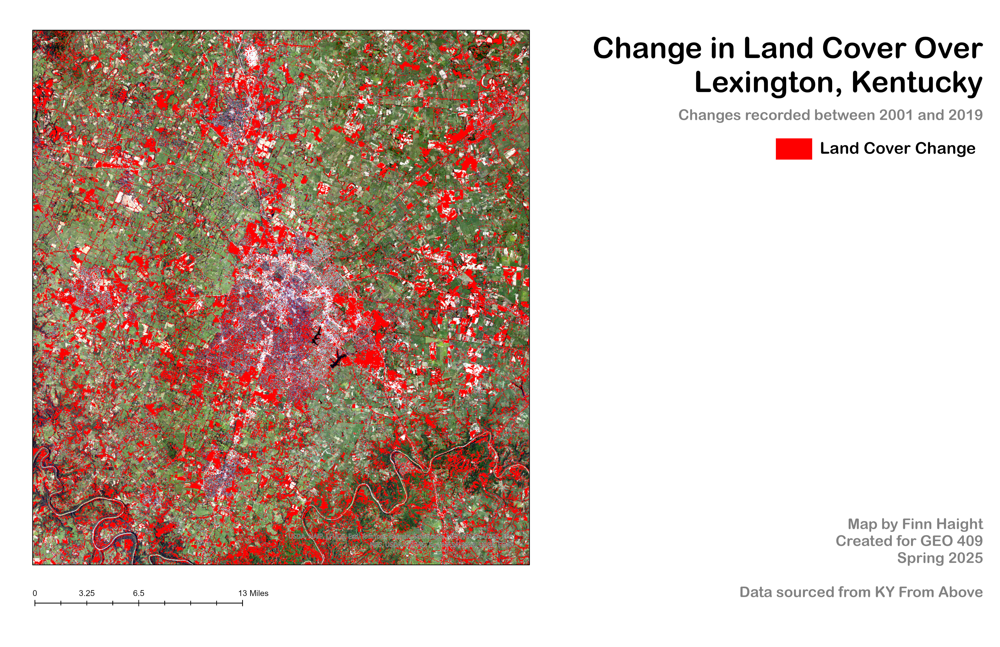

# Lab-06
# Lexington, KY 
## Measuring Change in Land Cover Between 2001 - 2019 Over a ~400 sq Mile Range

For this map, I want to look at how Lexington has changed over the span of nearly twenty years. Most of the land cover change is the result of construction, with the development of new roads, buildings, and other infrastructure leading to the city center occuring since 2001.

  
_Lexington Development_ 

Map created by Finn Haight for GEO 409 Spring 25. 
Data courtesey of KY From Above.